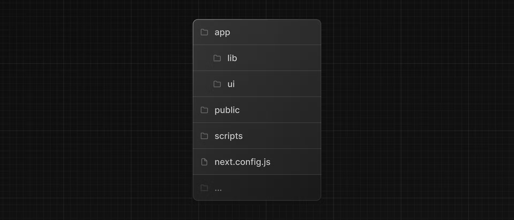

## Overview

공식 Next.js 참조 문서 링크

- [> Overview](https://nextjs.org/learn/dashboard-app#overview)
- [> Learn Next.js](https://nextjs.org/learn/dashboard-app)

[Styling](/NextJS/NextJS/%2302.%20CSS%20Style.md)

- Next.js에서 애플리케이션을 스타일

Optimizations

- 이미지, 링크, 및 폰트를 최적화

Routing

- 파일 시스템 라우팅을 사용하여 중첩된 레이아웃과 페이지를 생성

Data Fetching

- Vercel에서 데이터베이스를 설정하고 가져오고 스트리밍

Search and Pagination

- URL 검색 매개변수를 사용하여 검색 및 페이지네이션을 구현

Mutating Data

- React Server Actions를 사용하여 데이터를 변경하고 Next.js 캐시를 다시 유효화

Error Handling

- 일반 및 404를 찾을 수 없는 오류를 처리

Form Validation and Accessibility

- 서버 측 양식 유효성 검사 및 접근성을 개선

Authentication

- NextAuth.js 및 미들웨어를 사용하여 애플리케이션에 인증 추가

Metadata

- 메타데이터를 추가하고 애플리케이션을 소셜 공유에 준비

# Create next.js

`npx create-next-app@latest`<br>

```
What is your project named?  my-app
Would you like to use TypeScript?  No / Yes
Would you like to use ESLint?  No / Yes
Would you like to use Tailwind CSS?  No / Yes
Would you like to use `src/` directory?  No / Yes
Would you like to use App Router? (recommended)  No / Yes
Would you like to customize the default import alias (@/*)?  No / Yes

`src/` directory?
- 용도 및 목적에 따라 app/, components/ 등 조합이 가능하여 사용 권장

App Router? (recommended)
- 페이지 이동 (React 에서 최초 SPA 라우팅, 현재 Next.js 에선 페이지 이동 = 라우팅)

import alias
- 절대 경로로 단순화
```

## Folder structure


※ 초기 설정은 위와 같은 구조로 되어있지만, 프로젝트 개발 환경에 따라 달라질 수 있다.

- app : 애플리케이션의 모든 라우트, 컴포넌트 및 로직이 포함되어 있는 곳
- 하위 폴더는 프로젝트 개발 환경 세팅에 영향을 많이 받으므로 생략

## Placeholder data

데이터가 아직 로드되지 않았을 때 보여지는 가상의 데이터며, 일반적으로 데이터를 비동기적으로 가져오는 동안 사용자에게 로딩 상태를 보여주는 데 사용된다. 뒤에 설명할 loading.tsx(jsx)파일에서 보여주는데 사용될 수 있을 것 같다. 😏
