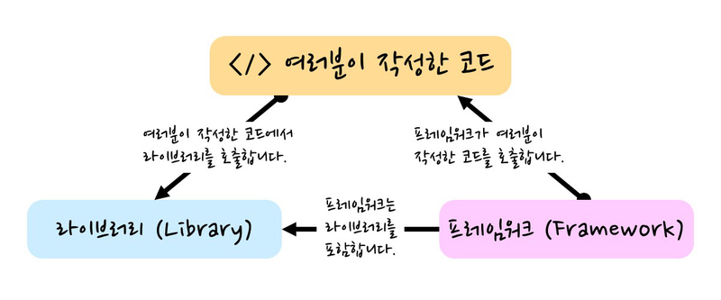
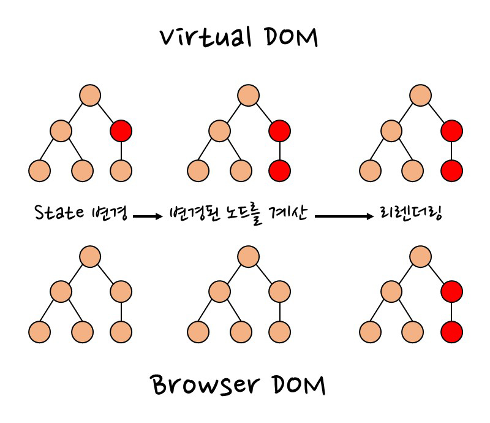
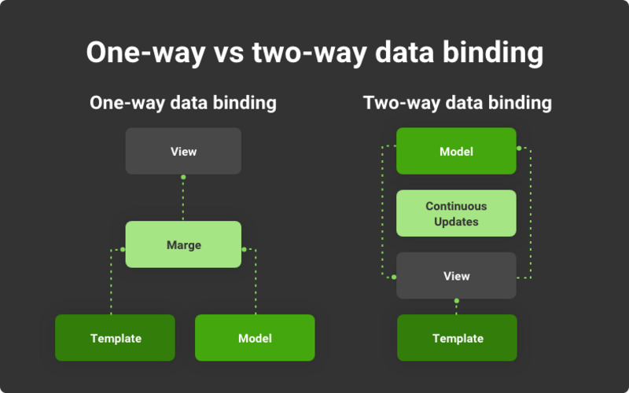

[> React](#react)<br>
[> 01. SPA](#01-spa)<br>
[> 02. Virtual DOM](#02-virtual-dom)<br>
[> 03. Binding](#03-binding)<br>
[> 04. JSX](#04-jsx-javascript-xml)<br>
[> 05. Babel](#05-babel)<br>

# 라이브러리와 프레임워크 차이



라이브러리 : 단일 문제 해결을 위한 도구<br>
프레임워크 :

- 라이브러리 집합
- 작업을 수행하기 위한 구조와 규칙을 제공하는 틀

⭐ 핵심적인 차이는 **제어권** 차이에 있다.

폰트<span style="font-size:250%">사이즈 250</span>

# React ?

React는 사용자 인터페이스를 만들기 위해 사용되는 자바스크립트 라이브러리 ( FE Library )

- SPA 개발에 주로 사용된다.
- Virtual DOM과 JSX개념을 사용한다.
- 컴포넌트라고 불리는 작은 코드 단위를 구성하여 복잡도를 줄이면서 구현을 진행할 수 있다.

## 01. SPA (Single Page Application)

SPA 방식에서는 페이지에서 필요한 부분만을 따로 내려받아 페이지를 Re-Render하기 때문에 Re-Loading이 발생하지 않는다.

- Re-Loading 방식이 일어나는 방식 (MPA), 페이지 자체를 새로 받아와서 브라우저에 그려준다.
- 첫 로딩시에는 필요한 정적 리소스를 모두 받아 렌더링 하기 때문에 초기 구동속도는 느리다.
- CSR (Client Side Render) 방식으로 SEO가 어렵다.

## 02. Virtual DOM



먼저 DOM (Document Object Model)은 노드와 객체로 문서를 표현하며, JS로 접근하여 수정할 수 있다.<br>
V-DOM은 View에서 변경되어야 할 부분을 효율적으로 찾아 업데이트할 수 있게하기 위해 만들어진 방식

- 메모리 상에서만 존재하는 가상의 DOM
- React State가 업데이트 되면 변경된 항목에 대하여 새로운 V-DOM에 렌더링한다.
- [⭐] Reconcilation(재조정)
  - 이전 V-DOM들과 현재 V-DOM을 비교하여 변경된 부분을 실제 DOM에 Re-Render를 단 한번만 하는것 !!

## 03. Binding



View와 Model의 데이터를 일치시키는 것 !

- View : 화면에 보이는 데이터
- Model : 메모리에서 처리하는 데이터

### 단방향 바인딩

- React 라이브러리는 단방향 바인딩 방식을 채용한다.
- 자바스크립트 코드를 통해서 데이터를 변경
  - 데이터를 처리하는 곳이 집중되어 있고, 명확하므로 데이터를 유지보수하기가 수월하다.
  - Model 상태 값 변경이 View를 변경할 수 있으므로, 불필요한 Re-Render를 하지 않는다.
    - 어디까지나..'Callback'으로 View에서 데이터를 변경하지 않는다는 전제하에..😅
      <br>Model < - > View 양방향 형식이 돼버리면 의미가 많이 퇴색한다.

## 04. JSX (JavaScript XML)

```javascript
// A. 아래 코드에서 JSX는 <div>, <h1> 같은 HTML 문법을 사용하여 UI를 표현하는 것을 의미한다.
// B. JSX에서 소괄호()는 여러 요소를 하나의 부모 요소로 묶을 때 사용된다.
// C. JSX에서 자바스크립트를 사용하기 위해서는 중괄호{}를 사용한다. {result} 값을 보면된다.
function App() {
  const result = 10 + 20;
  return (
    <div>
      <h1>Result : {result}</h1>
    </div>
  );
}

// 결과
// Result : 30
```

JSX는 컴포넌트 내 마크업(HTML, XML)과 자바스크립트 로직을 포함하여 사용할 수 있는 방식</br>

- 자바스크립트 코드 내에서도 HTML 코드처럼 UI를 바로 표현할 수 있다.
- 위 예제 코드를 보면 `<h1>` 태그를 이용하여 Result : {result}를 웹 브라우저 화면에 보여줄 수 있다.
- JSX 안에서 자바스크립트 표현식을 사용할 때 주의해야한다.
  - class, for같은 예약어를 사용할 수 없다.

## (A) JSX 문법

- 요소는 반드시 닫혀야 한다.<br>

  ```javascript
  function App() {
    return (
      // ERROR
      <h1>Hello, World!
    );
  }
  ```

- 컴포넌트에는 최상위 요소가 단 하나만 존재해야 한다.

  ```javascript
  function App() {
    return (
      // ERROR
      // 최상위 요소가 두개가 존재한다.
      <h1>Hello, World!</h1>
      <p>React도 안녕!</p>

      // 올바른 요소 반환 최상위 요소 <div></div>
      /*
      <div>
        <h1>Hello, World!</h1>
        <p>React도 안녕!</p>
      </div>
      */

      // 불필요한 <div>요소의 사용하지 않도록 Fragment라는 기능을 추가
      // <fragment></fragment> 또는 <></>로 fragment를 생략 가능하다.
    );
  }
  ```

- 자바스크립트 표현식은 중괄호({})로 감싸져야 한다.

  ```javascript
  export default function App() {
    const name = "홍길동";
    return <h1>Hello, {name}</h1>;
  }
  ```

- JSX 주석
  - 중괄호 사용 = { /_ 주석의 내용은 렌더링되지 않습니다! _/ }
  - /_ 중괄호로 감싸지 않으면 주석의 내용이 그대로 렌더링됩니다. _/

## 05. Babel

- 자바스크립트 코드를 변환해주는 도구 (트랜스파일러)
- 주로 최신 버전의 자바스크립트 문법을 이전 버전으로 변환하여 브라우저나 환경이 이해할 수 있는 코드로 변환한다.
  <br>

```javascript
// JSX
function App() {
  const result = 10 + 20;
  return (
    <div>
      <h1>Result : {result}</h1>
    </div>
  );
}
```

```Javascript
// Babel을 통해 JSX -> 자바스크립트 변환
import { jsxs as _jsxs } from "react/jsx-runtime";
import { jsx as _jsx } from "react/jsx-runtime";
function App() {
  const result = 10 + 20;
  return /*#__PURE__*/_jsx("div", {
    children: /*#__PURE__*/_jsxs("h1", {
      children: ["Result : ", result]
    })
  });
}
```

이후 런타임에서 JSON으로 변환한다는데.. 코드로 보여주긴 어렵네 [....]<br>
[⭐] JSX → JS → JSON : JSX 는 컴파일 시 Babel 통해 JS 로 변환, 런타임에서는 JSON 으로 변환

## 06. Component

> React에서 컴포넌트란 자바스크립트 함수의 개념과 비슷하다.

```javascript
function App() {
  function temp() {}
  const result = 10 + 20;
  return (
    <div>
      <h1>Result : {result}</h1>
    </div>
  );
}
// App  : 컴포넌트
// temp : 메서드(함수)
```

> React에서 UI를 설계할 때 사용자가 볼 수 있는 화면을 여러 개의 컴포넌트로 나누어 구성함으로써 각각의 컴포넌트를 개별적으로 관리할 수 있습니다.
>
> > 회원 가입 페이지
> >
> > > └ 아이디 및 비밀번호 입력 컴포넌트<br>
> > > └ 주소 입력 컴포넌트<br>
> > > └ 사용자 인증 컴포넌트<br>그 외, 회원 가입에 필요한 다양한 컴포넌트를 구성하여 페이지를 완성한다.

- 컴포넌트 재사용이 가능하다.
- 데이터(props)를 입력 받아 View의 상태를 정의하는 엘리먼트를 반환한다.
- 반드시 컴포넌트의 이름을 대문자로 시작하도록 작성
  - 소문자가 들어갈 시 `<h1>` 태그나 `<div>`처럼 HTML 태그로 인식하는 문제가 발생
- 클래스 기반과 함수 기반의 컴포넌트를 사용할 수 있는데 함수 컴포넌트를 권장한다. (React 공식 문서)

  - 함수 컴포넌트가 클래스 컴포넌트보다 지원하는 기능이 적거나, Life Cycle에 대한 문제점으로 클래스를 사용했지만, Hooks의 등장으로 문제가 해결되면서 함수 컴포넌트 기반의 장점과 Hooks가 합쳐지면서 함수 기반의 컴포넌트 사용을 권장하게 되었다.

  ```javascript
  ReactDOM.render(<Hello name="Mike" />, document.getElementById("root"));

  function Hello({ name }) {
    return (
      <div>
        <h1>My name is {name}</h1>
      </div>
    );
  }

  // 웹 브라우저 화면 결과
  // My name is Mike
  ```
