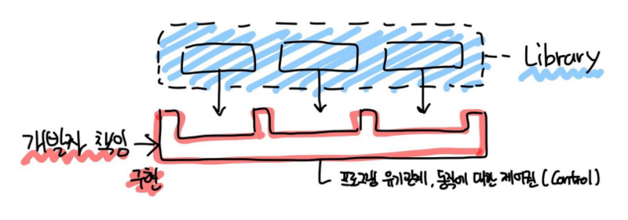
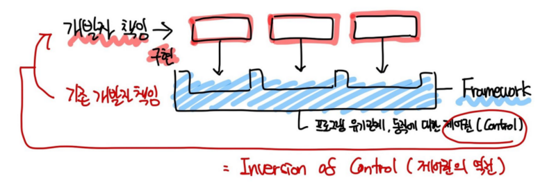

# React ?

## 라이브러리와 프레임워크 차이

라이브러리 : 단일 문제 해결을 위한 도구 
프레임워크 : 작업을 수행하기 위한 구조와 규칙을 제공하는 틀

🔑 핵심은 **제어권의 차이**에 있다.

 
라이브러리 : 흐름 제어권은 개발자가 가지고 있고 상세 기능은 라이브러리를 사용하여 구현

 
프레임워크 : 흐름 제어권을 개발자가 가지지 않고, 흐름에 맞춰 개발자는 구현부를 추가한다.

---

## 단방향 바인딩

## 양방향 바인딩
