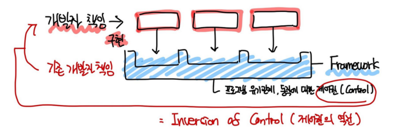

# 라이브러리와 프레임워크 차이

](images/libray_framework.jpg)

라이브러리 : 단일 문제 해결을 위한 도구 
프레임워크 : 작업을 수행하기 위한 구조와 규칙을 제공하는 틀

🔑 핵심은 **제어권의 차이**에 있다.

](images/library.png) 
라이브러리 : 흐름 제어권은 개발자가 가지고 있고 상세 기능은 라이브러리를 사용하여 구현

](images/framework.png) 
프레임워크 : 흐름 제어권을 개발자가 가지지 않고, 흐름에 맞춰 개발자는 구현부를 추가한다.

---

# React ?

React는 사용자 인터페이스(UI)를 만들기 위해 사용되는 자바스크립트 라이브러리 **( FE Library )**

- SPA (Single Page Application) 개발에 주로 사용된다.
- Virtual DOM과 JSX(JavaScript XML) 개념을 사용한다.
- **컴포넌트**라고 불리는 작은 코드 단위를 구성하여 복잡도를 줄이면서 구현을 진행할 수 있다.

## 01. SPA

SPA 방식에서는 페이지에서 필요한 부분만을 따로 내려받아 페이지를 Re-Render하기 때문에 Re-Loading이 발생하지 않는다.

- Re-Loading 방식이 일어나는 방식 (MPA), 페이지 자체를 새로 받아와서 브라우저에 그려준다.
- **첫 로딩시에는 필요한 정적 리소스를 모두 받아 렌더링** 하기 때문에 초기 구동속도는 느리다.
- CSR (Client Side Render) 방식으로 SEO가 어렵다.

## 02. Virtual DOM

먼저 DOM (Document Object Model)은 노드와 객체로 문서를 표현하며, JS로 접근하여 수정할 수 있다. 
V-DOM은 **View에서 변경되어야 할 부분을 효율적으로 찾아 업데이트**할 수 있게하기 위해 만들어진 방식

- 메모리 상에서만 존재하는 가상의 DOM
- React State가 업데이트 되면 변경된 항목에 대하여 **새로운 V-DOM에 렌더링한다.**
  - [⭐⭐⭐] 이전 V-DOM들과 현재 V-DOM을 비교하여 변경된 부분을 실제 DOM에 Re-Render를 단 한번만 하는것 !!

## 03. Component

## 02. 바인딩

### View와 Model의 데이터를 일치시키는 것 ! 🧐

- View : 화면에 보이는 데이터
- Model : 메모리에서 처리하는 데이터

### 02-(A) 단방향 바인딩

- React 라이브러리는 단방향 바인딩 방식을 채용한다.
- Javascript 코드를 통해서 데이터를 변경
  - 데이터를 처리하는 곳이 집중되어 있고, 명확하므로 데이터를 유지보수하기가 수월하다.
  -

### 02-(B) 양방향 바인딩
